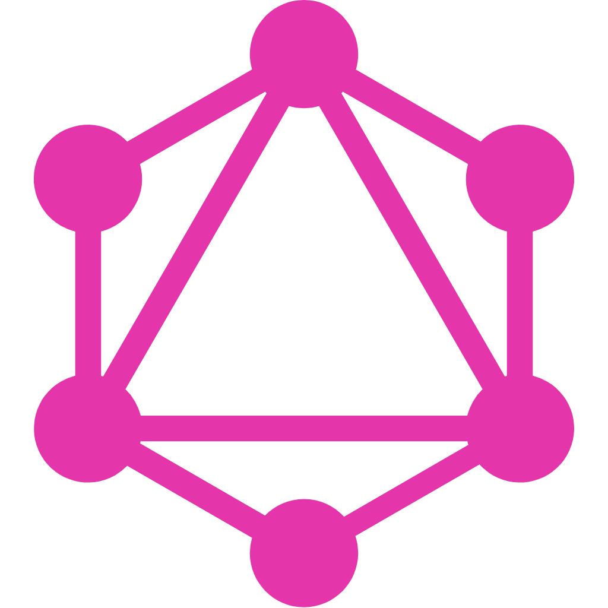
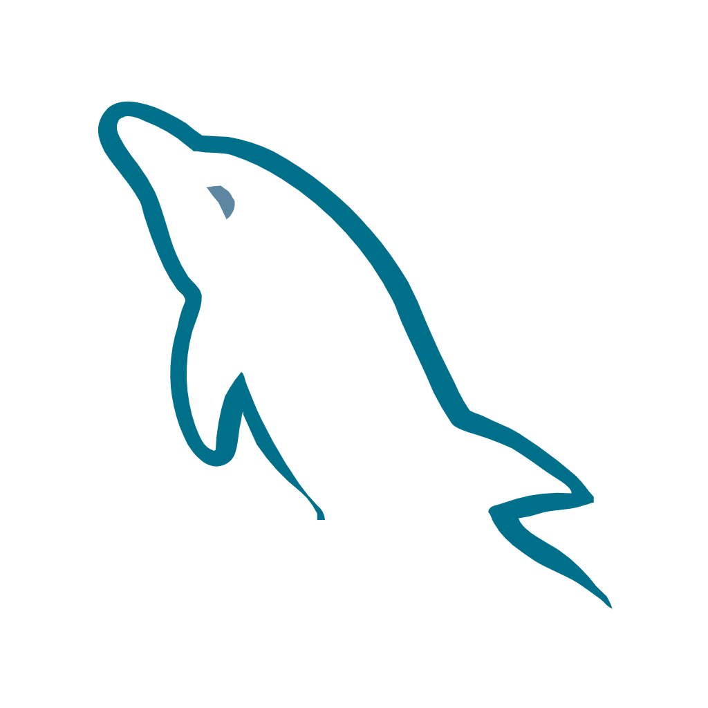
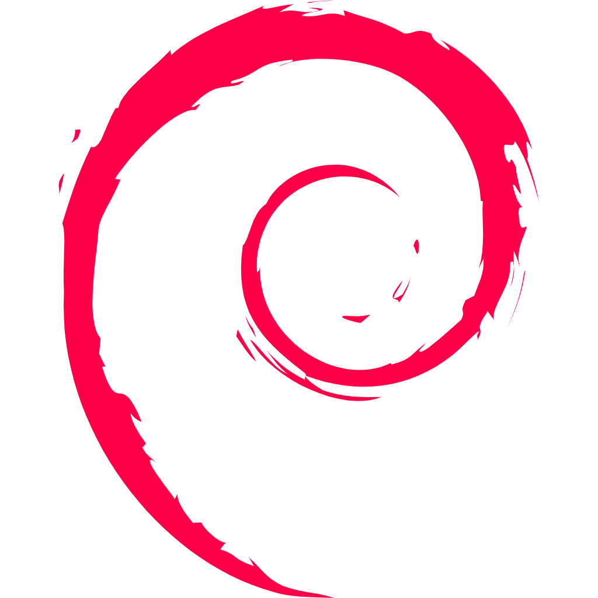

# ⛩️ ようこそ、旅人  
**You’ve arrived at the sacred gate of inconsistent commits, half-finished personal projects(got bored) and and TODOs whispered into the void.**
 
 
 
**Within lies Java, Spring-Boot, React and... a bit of GDScript — tread wisely, travaler.**
 
 
 
 

<h2>🪄 For my frontend, I invoke the magic of...</h2>

  &nbsp;&nbsp;&nbsp;&nbsp;&nbsp;&nbsp;&nbsp;&nbsp;
  &nbsp;&nbsp;&nbsp;&nbsp;&nbsp;&nbsp;&nbsp;&nbsp;
  &nbsp;&nbsp;&nbsp;&nbsp;&nbsp;&nbsp;&nbsp;&nbsp;
  

 
 

<h2>🏰 For my backend, I call upon the strength of...</h2>

  &nbsp;&nbsp;&nbsp;&nbsp;&nbsp;&nbsp;&nbsp;&nbsp;
  &nbsp;&nbsp;&nbsp;&nbsp;&nbsp;&nbsp;&nbsp;&nbsp;
  

 
 

<h2>📜 For my databases, I seek the wisdom of...</h2>

  &nbsp;&nbsp;&nbsp;&nbsp;&nbsp;&nbsp;&nbsp;&nbsp;
  &nbsp;&nbsp;&nbsp;&nbsp;&nbsp;&nbsp;&nbsp;&nbsp;
  

 
 

<h2>🎮 When my heart desires gamedev, I find solace in...</h2>

  

 
 
 
 

<h2>🏯 My dojo of choice, of course...</h2>

  &nbsp;&nbsp;&nbsp;&nbsp;&nbsp;&nbsp;&nbsp;&nbsp;
  

