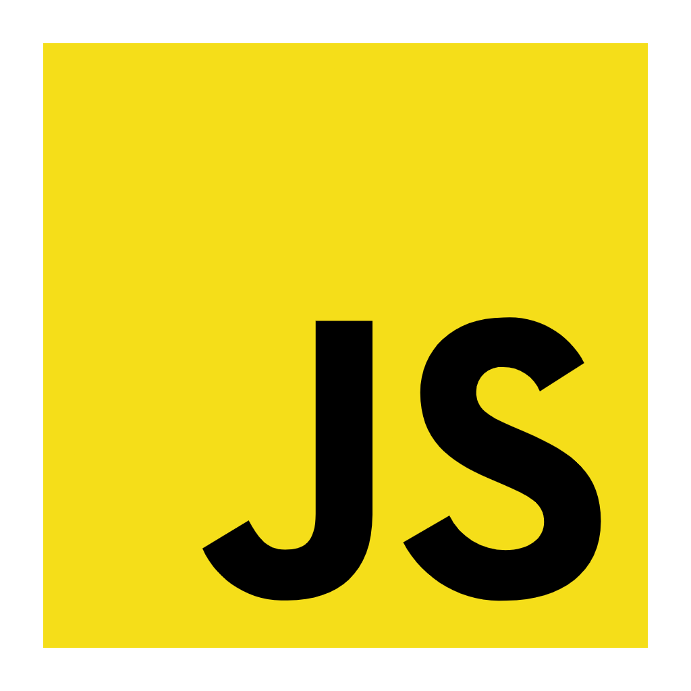

# ⛩️ ようこそ、旅人

---

<h3 style="font-family: 'JetBrains Mono', monospace;">Languages {< / >}</h3>

  
  
  
  
  
  

---

<h3 style="font-family: 'JetBrains Mono', monospace;">Frameworks / Tools [■--■--■]</h3>

  
  
  
  
  
  

---

<h3 style="font-family: 'JetBrains Mono Regular', monospace;">Databases [===]</h3>

  
  
  

---

<h3 style="font-family: 'JetBrains Mono', monospace;">Also a little hobby in game-making [+ -]</h3>

---

<h3 style="font-family: 'JetBrains Mono', monospace;">Debian 4 life
</h3>

---

<h3 style="font-family: 'JetBrains Mono', monospace;">KTHXBYE (^._.^)ﾉ
</h3>